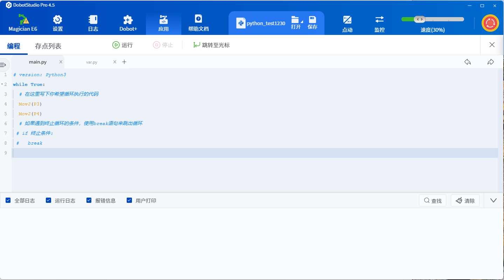
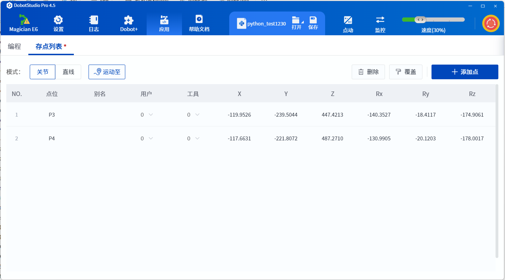
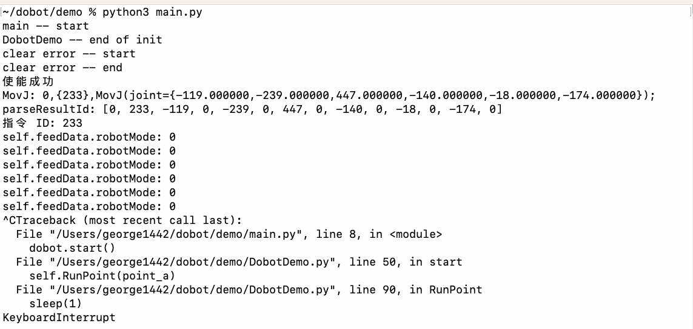

### 1、E6机器人的二次开发，是否参考该文档

越疆官网：服务支持 | 下载中心 | 数据类型 | 二次开发 | TCP_IP远程控制接口文档（V3） · 2024-09-09

### 2、E6机器人的 Demo 程序，是否参考如下程序

假定二次开发文档，是[1]提到的，我是否参考如下 Demo 程序：
https://github.com/Dobot-Arm/TCP-IP-Python-V4

### 3、Demo 程序执行后，貌似不成功

1、屏幕信息：使能也成功的。
2、但机器人底座环形灯变为红色了。
3、可能是 DobotDemo.py 中的2个点的位置坐标不大正确。以下是 demo 程序中的数值：
        point_a = [0, 0, 202, -4, 9, -164]
        point_b = [-10, 0, 202, -4, 9, -164]

4、在 DobotSudio Pro4.5 界面中，执行如下 Python 程序，是正常的：机械臂在2个点之间重复运动。

5、DobotDemo.py 中的2个点的位置坐标，修改为如下（参考第4点的2个点的坐标）
        point_a = [-119, -239, 447, -140, -18, -174]
        point_b = [-117, -221, 487, -130, -20, -178]

6、执行 python3 main.py，机械臂底座环形灯，还是红色。界面输出信息如下：
